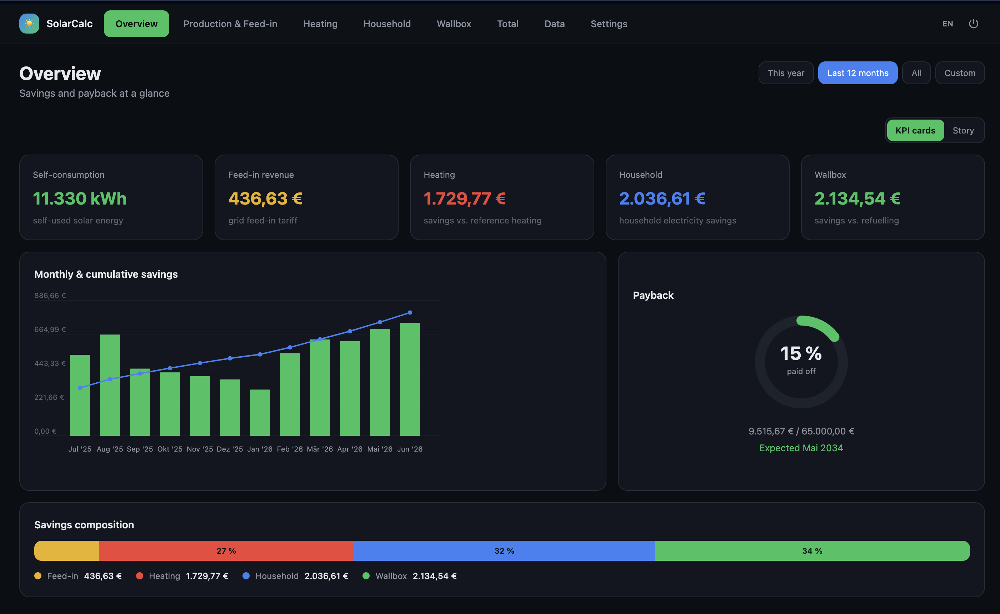
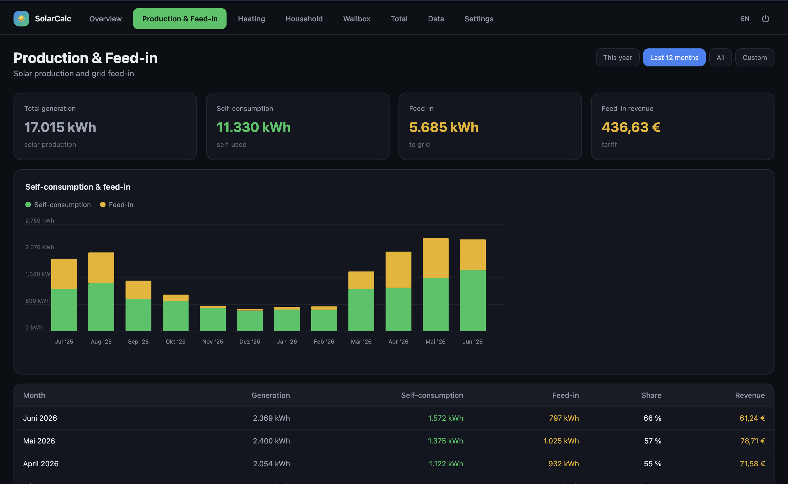
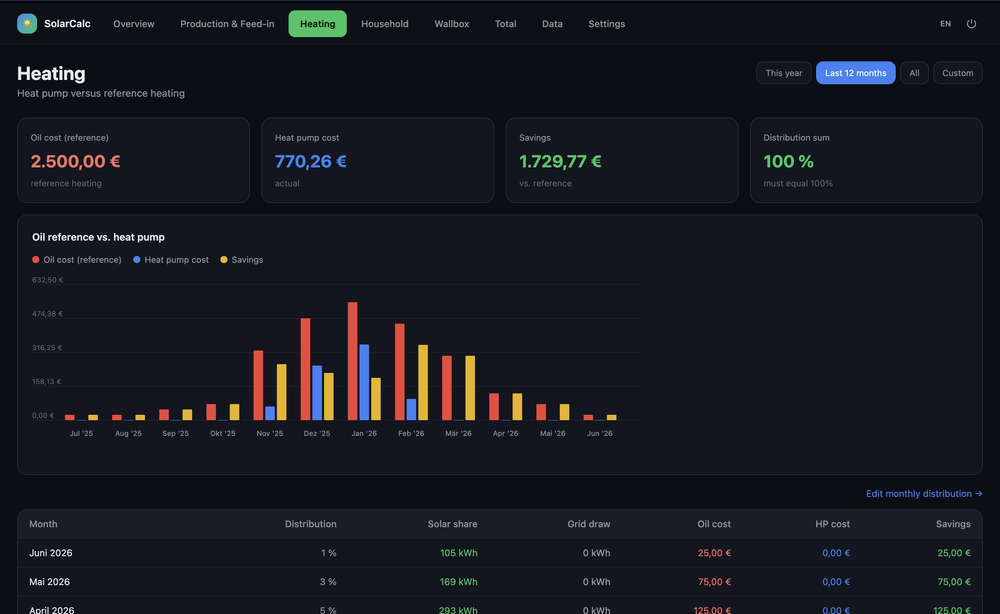
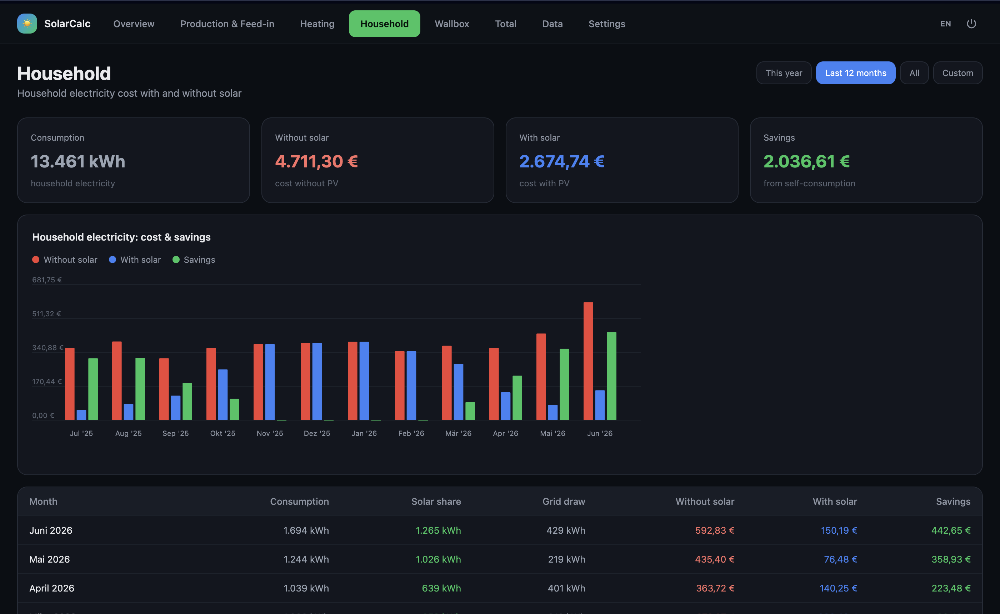
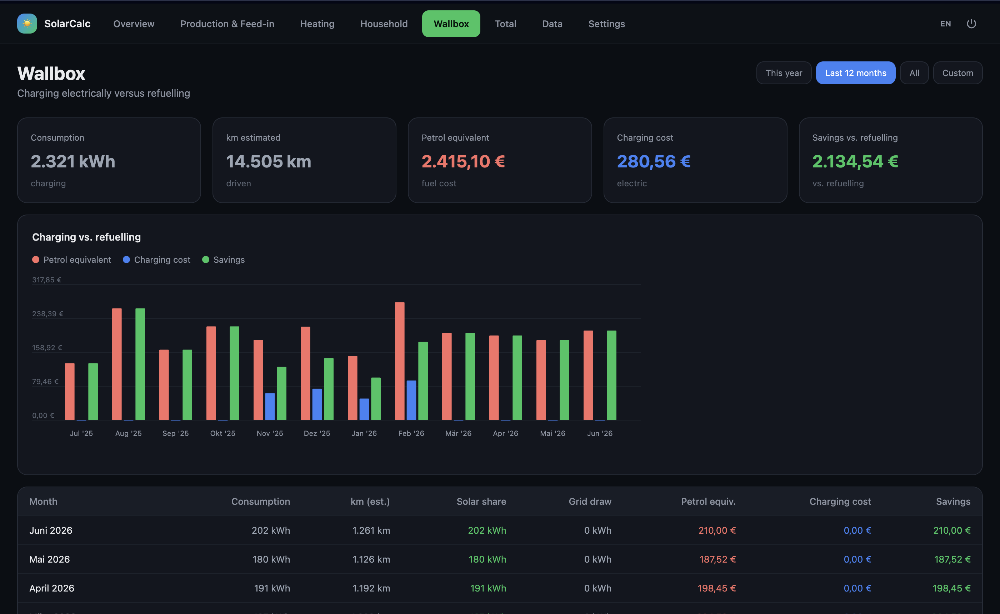
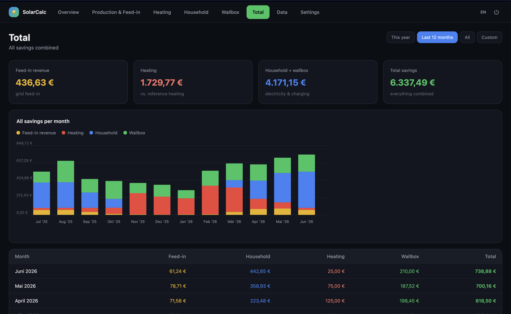
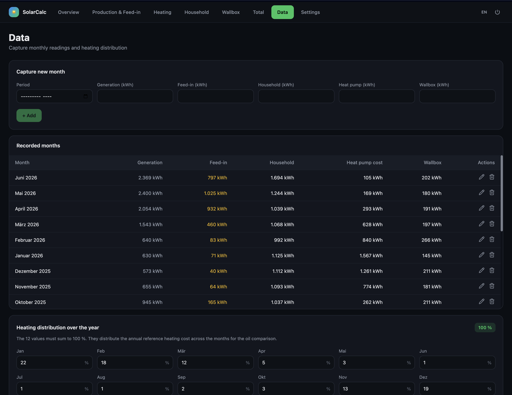
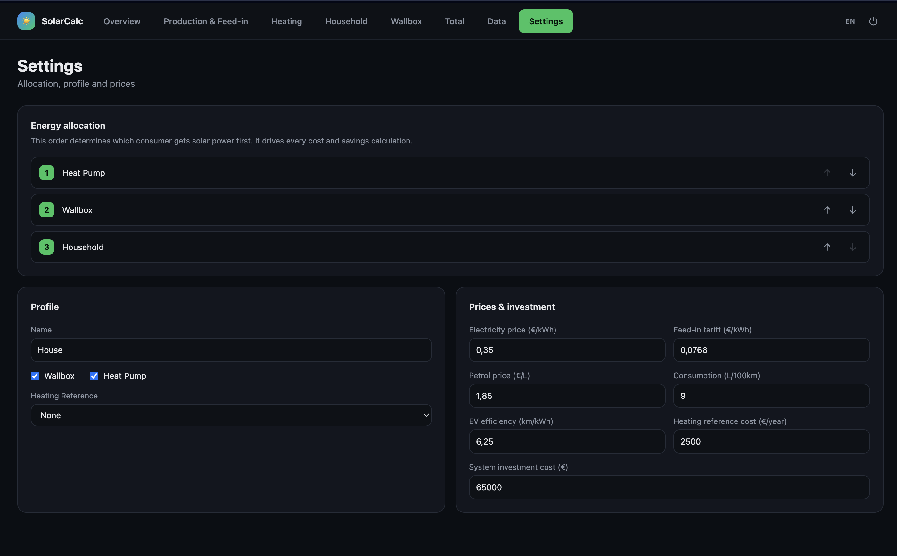

# SolarCalc

SolarCalc turns your monthly meter readings into money. Enter what your PV system
generated, fed into the grid, and what your household, heat pump, and wallbox
consumed — SolarCalc works out how much you saved against oil heating, grid
electricity, and refuelling, and how far along you are toward paying off the
system.

The allocation order in **Settings** decides which consumer gets solar power
first, which drives every cost and savings figure across all views. Every screen
supports a time filter (**This year**, **Last 12 months**, **All**, **Custom**).

---

## Overview

Savings and payback at a glance.

- **KPI cards** — self-consumed solar energy (kWh), feed-in revenue, and savings
  split by heating, household, and wallbox.
- **Monthly & cumulative savings** — bars per month with a cumulative trend line.
- **Payback** — donut showing percent of the system investment paid off, the
  running total vs. total cost, and the expected break-even date.
- **Savings composition** — one bar breaking total savings into feed-in, heating,
  household, and wallbox shares.

## Production & Feed-in

Solar production and what goes to the grid.

- **KPI cards** — total generation, self-consumption, feed-in to grid, and feed-in
  revenue at the configured tariff.
- **Stacked chart** — self-consumption vs. feed-in per month.
- **Table** — per-month generation, self-consumption, feed-in, self-consumption
  share (%), and revenue.

## Heating

Heat pump versus a reference oil heating.

- **KPI cards** — reference oil cost, actual heat pump cost, savings vs. reference,
  the distribution sum (must equal 100%), and the rough energy efficiency class.
- **Grouped chart** — oil reference cost, heat pump cost, and savings per month.
- **Table** — monthly heating-cost distribution (%), solar share, grid draw, oil
  cost, heat pump cost, and savings. The annual oil cost is spread across months
  using the distribution edited on the **Data** page.

## Household

Household electricity cost with and without solar.

- **KPI cards** — total consumption, cost without solar, cost with solar, and
  savings from self-consumption.
- **Grouped chart** — cost without solar, cost with solar, and savings per month.
- **Table** — monthly consumption, solar share, grid draw, and the three cost
  columns.

## Wallbox

EV charging versus refuelling a combustion car.

- **KPI cards** — charging consumption (kWh), estimated km driven, petrol
  equivalent fuel cost, electric charging cost, and savings vs. refuelling.
- **Grouped chart** — petrol equivalent, charging cost, and savings per month.
- **Table** — monthly consumption, estimated km, solar share, grid draw, petrol
  equivalent, charging cost, and savings.

## Total

All savings combined.

- **KPI cards** — feed-in revenue, heating savings, household + wallbox savings,
  and total savings across everything.
- **Stacked chart** — feed-in, heating, household, and wallbox stacked per month.
- **Table** — monthly savings per category with a combined total column.

## Grid & tariff

Grid purchases against a fixed-price contract.

- **KPI cards** — energy bought from the grid (kWh), the average unit price actually paid
  (weighted by kWh), the resulting cost, and the difference against the electricity price
  configured in **Settings**. A positive difference means the dynamic tariff came out cheaper.
- **Grouped chart** — actual grid cost vs. what the same energy would have cost at the fixed
  contract price, per month.
- **Table** — per-month grid draw, average price, actual cost, cost at the fixed price, and the
  difference.

The average price per month comes from the optional **Ø electricity price** field on the **Data**
page. Months left empty fall back to the electricity price in **Settings**, so their difference is
zero. This comparison is reported on its own — it never feeds total savings or the payback
projection, which measure what the PV system earns rather than what the tariff choice earns.

## Data

Where you enter everything.

- **Capture new month** — add a period with generation, feed-in, household, heat
  pump, and wallbox readings (all in kWh), plus an optional average electricity price
  (€/kWh) for that month. Leave the price empty to use the one from **Settings**.
- **Recorded months** — table of all entered months, editable and deletable.
- **Heating distribution over the year** — twelve percentages that must sum to
  100%, used to spread the annual reference oil cost across the months for the
  heating comparison.

## Settings

Allocation, profile, and prices.

- **Energy allocation** — ordered list (heat pump → wallbox → household) deciding
  which consumer receives solar power first. Drives every calculation.
- **Profile** — installation name, which consumers exist (wallbox, heat pump), and
  the heating reference type.
- **Prices & investment** — electricity price, feed-in tariff, petrol price, car
  consumption (L/100km), EV efficiency (km/kWh), heating reference cost (€/year),
  and total system investment cost used for the payback calculation. The electricity
  price doubles as the fixed-contract reference on the **Grid & tariff** page.
- **Building & energy efficiency** — living area (m²) and the heat pump's seasonal
  performance factor (SCOP/JAZ). From the last twelve months of heat-pump readings these
  give a rough German energy efficiency class (A+…H), shown here and as a KPI on the
  **Heating** page. It needs twelve consecutive months of data; until then it says so
  instead of guessing. It estimates the building envelope by converting heat-pump
  electricity into delivered heat — it is not an Energieausweis, and it ignores the
  hot-water share and primary energy factors.